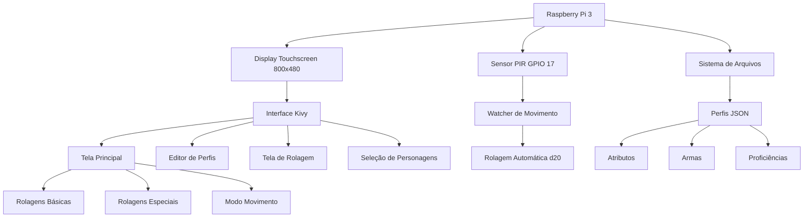

# D&D Dice Roller - Projeto Semestral

D&D Dice Roller é um sistema embarcado desenvolvido como projeto semestral da disciplina Microcontroladores e Sistemas Embarcados (EEN251) do Instituto Mauá de Tecnologia. Trata-se de um rolador de dados digital interativo para RPG de mesa (Dungeons & Dragons), capaz de realizar diversos tipos de rolagens com cálculo automático de modificadores, combinando interface touchscreen com sensor de movimento PIR para detecção de gestos.

## Sumário
- [Requisitos](#requisitos)
- [Escopo](#escopo)
- [Diagrama de blocos](#diagrama-de-blocos)
- [Tecnologias](#tecnologias)
- [Materiais](#materiais)
- [Modelagem financeira](#modelagem-financeira)
- [Funcionamento](#funcionamento)
- [Instalação](#instalação)
- [Testes](#testes)
- [Autores](#autores)

## Requisitos
| ID | Requisito | Tipo |
|----|-----------|------|
| 1  | Utilizar sensor PIR para detecção de movimento | Técnico |
| 2  | Interface touchscreen para interação com usuário | Funcional |
| 3  | Sistema de gerenciamento de personagens D&D | Funcional |
| 4  | Cálculo automático de modificadores e proficiências | Funcional |
| 5  | Utilizar Raspberry Pi 3 como plataforma embarcada | Técnico |
| 6  | Animações visuais para simulação de rolagem de dados | Funcional |
| 7  | Suporte a múltiplos tipos de dados (d4, d6, d8, d10, d12, d20, d100) | Funcional |
| 8  | Sistema de rolagem por movimento (gesture-based rolling) | Técnico |
| 9  | Armazenamento persistente de perfis de personagens | Funcional |
| 10 | Interface gráfica adaptada para tela 800x480 | Técnico |

## Escopo
O projeto consiste em um rolador de dados digital para D&D 5ª Edição que oferece:

1. **Sistema de Personagens**: Gerenciamento completo de fichas com atributos, níveis e proficiências
2. **Rolagens Especializadas**:
   - Ataques com armas (com modificadores de habilidade e proficiência)
   - Testes de resistência (saving throws)
   - Testes de habilidade e perícias (18 skills do D&D 5e)
   - Rolagens de dano
3. **Rolagem por Movimento**: Sensor PIR detecta movimento do jogador para disparar rolagens de d20
4. **Interface Touchscreen**: Sistema completo de teclado virtual e navegação por toque
5. **Animações Visuais**: Dados 3D rotacionando durante as rolagens

## Diagrama de blocos


## Tecnologias
- **Python 3.11**: Linguagem principal do projeto
- **Kivy 2.1.0**: Framework para interface gráfica touchscreen
- **RPi.GPIO**: Controle de GPIO para sensor PIR
- **Threading**: Monitoramento assíncrono do sensor de movimento
- **JSON**: Armazenamento persistente de dados de personagens
- **Canvas Graphics**: Animações 2D de dados rotacionando
- **Event-Driven Architecture**: Sistema de callbacks para interações
- **Object-Oriented Design**: Estrutura modular com componentes reutilizáveis

## Materiais
| Componente | Quantidade |
|------------|------------|
| Raspberry Pi 3 Model B+ | 1 |
| Display Touchscreen 7" 800x480 | 1 |
| Sensor PIR HC-SR501 | 1 |
| Cartão MicroSD 16GB | 1 |
| Fonte 5V 2.5A Micro USB | 1 |
| Cabos Jumper Fêmea-Fêmea | 3 |
| Case para Raspberry Pi | 1 |

**Diagrama de conexões:**

```
Raspberry Pi 3 (GPIO BCM):
  GPIO 17 -> OUT (PIR Sensor)
  5V      -> VCC (PIR Sensor)
  GND     -> GND (PIR Sensor)
  
Display Touchscreen:
  DSI     -> Conector DSI (Raspberry Pi)
  USB     -> Porta USB (Touch Input)
```

**Pinout do Sensor PIR:**
- VCC: 5V (alimentação)
- GND: Terra
- OUT: GPIO 17 (sinal digital de detecção)

## Modelagem financeira

| Item | Preço Unitário (R$) | Quantidade | Preço Total (R$) |
|------|---------------------|------------|------------------|
| Raspberry Pi 3 Model B+ | 350,00 | 1 | 350,00 |
| Display Touchscreen 7" 800x480 | 250,00 | 1 | 250,00 |
| Sensor PIR HC-SR501 | 8,00 | 1 | 8,00 |
| Cartão MicroSD 16GB Classe 10 | 25,00 | 1 | 25,00 |
| Fonte 5V 2.5A Micro USB | 30,00 | 1 | 30,00 |
| Cabos Jumper | 15,00 | 1 conjunto | 15,00 |
| Case Raspberry Pi com suporte display | 45,00 | 1 | 45,00 |
| **TOTAL** | | | **723,00** |

## Funcionamento

### 1. Inicialização
```python
# Configuração do display e GPIO
Config.set('graphics', 'fullscreen', '1')
Config.set('graphics', 'width', '0')
Config.set('graphics', 'height', '0')

# Inicialização do sensor PIR
GPIO.setmode(GPIO.BCM)
GPIO.setup(17, GPIO.IN)
```

### 2. Sistema de Personagens
- **Criação de Perfis**: Formulário completo com:
  - Nome do personagem
  - Nível (1-20)
  - 6 atributos (STR, DEX, CON, INT, WIS, CHA)
  - Lista de armas personalizadas
  - Proficiências em perícias (18 skills)
  - Proficiências em testes de resistência

- **Armazenamento**: Arquivos JSON em `data/characters`
  ```json
  {
    "name": "Gandalf",
    "level": 20,
    "abilities": {"STR": 10, "DEX": 12, "CON": 14, "INT": 18, "WIS": 16, "CHA": 14},
    "weapons": [
      {"name": "Cajado", "ability": "STR", "proficient": true, "damage_dice": "d6", "damage_bonus": 0}
    ],
    "skill_proficiencies": ["Arcana", "History", "Investigation"],
    "saving_throw_proficiencies": ["INT", "WIS"]
  }
  ```

### 3. Tipos de Rolagem

#### A. Rolagens Básicas
- **Dados suportados**: d4, d6, d8, d10, d12, d20, d100, Custom
- **Animação**: Rotação 720° + escala pulsante (1.3x → 0.8x → 1.0x)
- **Imagens**: PNG dos dados reais em `assets/images`

#### B. Rolagens de Ataque
```python
# Cálculo automático
modifier = ability_modifier + proficiency_bonus
total = 1d20 + modifier

# Exemplo: Ataque com espada (+3 STR, proficiente, nível 5)
# modifier = 3 + 3 = +6
# Rolagem: 1d20+6
```

#### C. Testes de Habilidade
- **18 Skills do D&D 5e**:
  - STR: Athletics
  - DEX: Acrobatics, Sleight of Hand, Stealth
  - INT: Arcana, History, Investigation, Nature, Religion
  - WIS: Animal Handling, Insight, Medicine, Perception, Survival
  - CHA: Deception, Intimidation, Performance, Persuasion

- **Cálculo com proficiência**:
  ```python
  if skill in character.skill_proficiencies:
      modifier = ability_modifier + proficiency_bonus
  else:
      modifier = ability_modifier
  ```

#### D. Rolagem por Movimento (Motion Sensor)
1. **Ativação**: Usuário pressiona "Motion Sensor Roll (d20)"
2. **Estabilização**: Sensor aguarda 6 segundos para calibração
3. **Detecção**: Thread monitora GPIO.input(17) a cada 0.1s
4. **Trigger**: Ao detectar movimento, dispara rolagem automática de d20
5. **Log**: Imprime no console: `Roll: {character_name} rolled {value}`

### 4. Fluxo de Interface

```
[Tela Principal]
  ├─> Selecionar Personagem → [Lista de Perfis]
  ├─> Attack → [Seleção de Arma] → [Rolagem d20+mod] → [Resultado Hit/Miss]
  ├─> Saving Throw → [Escolha STR/DEX/CON/INT/WIS/CHA] → [Rolagem d20+mod]
  ├─> Ability Check → [18 Skills] → [Rolagem d20+mod+prof]
  ├─> Dados (d4-d100) → [Animação] → [Resultado]
  └─> Motion Sensor Roll → [Aguarda movimento] → [Rolagem d20 automática]
```

### 5. Componentes Customizados

#### PrimaryButton
```python
class PrimaryButton(Button):
    background_color = [0.863, 0.078, 0.235, 1]  # Crimson
    color = [1, 1, 1, 1]  # Texto branco
    font_size = 18
    bold = True
```

#### DiceButton
```python
class DiceButton(Button):
    background_color = [0.863, 0.078, 0.235, 1]  # Vermelho
    # Animação de pressão/soltura
```

#### Virtual Keyboard
- Teclado QWERTY completo em tela
- Números e caracteres especiais
- Backspace, Space, Enter
- Auto-foco em campos de texto

### 6. Sistema de Animação

```python
class DiceAnimation:
    def start_roll(self, dice_type, duration=2.0, pause_before=0.5):
        # 1. Pausa inicial (0.5s)
        # 2. Carrega imagem do dado (assets/images/d{type}.png)
        # 3. Rotação de 720° em 2 segundos
        # 4. Escala: 1.0 → 1.3 → 0.8 → 1.0
        # 5. Randomização de valores durante rolagem
        # 6. Exibição do resultado final
```

## Instalação

### Requisitos
- Raspberry Pi OS (Bookworm ou superior)
- Python 3.11+
- Tela touchscreen 800x480

### Dependências
```bash
sudo apt update
sudo apt install python3-pip python3-kivy python3-rpi.gpio
pip3 install kivy==2.1.0
```

### Execução
```bash
cd /home/pi/Documentos/t2_micro
python3 app.py
```

## Estrutura de Arquivos
```
t2_micro/
├── app.py                      # Aplicação principal
├── main.py                     # Ponto de entrada alternativo
├── components/                 # Componentes reutilizáveis
│   ├── buttons.py             # PrimaryButton, DiceButton
│   ├── dialogs.py             # Diálogos de seleção
│   ├── text_inputs.py         # Campos de texto customizados
│   ├── virtual_keyboard.py    # Teclado virtual
│   └── dice_animations.py     # Animações de dados
├── screens/                    # Telas da aplicação
│   ├── main_screen.py         # Tela principal
│   ├── roll_screen.py         # Tela de rolagem
│   ├── profile_screen.py      # Lista de personagens
│   └── profile_editor.py      # Editor de personagem
├── kv/                         # Arquivos de layout Kivy
│   ├── main_screen.kv
│   ├── roll_screen.kv
│   ├── profile_screen.kv
│   └── profile_editor.kv
├── utils/                      # Utilitários
│   ├── file_utils.py          # Gerenciamento de arquivos JSON
│   └── motion_sensor.py       # Interface com sensor PIR
├── assets/
│   └── images/                # Imagens dos dados (PNG)
│       ├── d4.png
│       ├── d6.png
│       ├── d8.png
│       ├── d10.png
│       ├── d12.png
│       ├── d20.png
│       └── d100.png
├── data/
│   └── characters/            # Perfis salvos (JSON)
├── run_dice_roller.sh         # Script de execução
└── DnD_Dice_Roller.desktop    # Atalho para desktop
```

## Testes

### Teste 1: Rolagem Básica de Dados
**Procedimento**: Selecionar d20 na tela principal  
**Resultado Esperado**: Animação de rotação + valor entre 1-20  
**Status**: ✅ Aprovado

### Teste 2: Cálculo de Modificadores de Ataque
**Procedimento**: 
- Criar personagem com STR 16 (+3)
- Adicionar arma "Espada" (STR, proficiente)
- Personagem nível 5 (bonus +3)
- Rolar ataque

**Resultado Esperado**: d20 + 6 (3+3)  
**Status**: ✅ Aprovado

### Teste 3: Proficiência em Perícias
**Procedimento**:
- Marcar proficiência em "Stealth"
- Rolar Ability Check → Stealth

**Resultado Esperado**: d20 + DEX modifier + proficiency bonus  
**Status**: ✅ Aprovado

### Teste 4: Sensor de Movimento
**Procedimento**:
- Pressionar "Motion Sensor Roll (d20)"
- Aguardar 6s (estabilização)
- Passar mão em frente ao sensor PIR

**Resultado Esperado**: 
- Status muda para "Waiting for motion"
- Ao detectar movimento, rola d20 automaticamente
- Console imprime: `Roll: {character} rolled {value}`

**Status**: ✅ Aprovado

### Teste 5: Persistência de Dados
**Procedimento**:
- Criar personagem "Teste" com STR 18
- Fechar aplicação
- Reabrir aplicação

**Resultado Esperado**: Personagem "Teste" carregado com STR 18  
**Status**: ✅ Aprovado

### Teste 6: Interface Touchscreen
**Procedimento**: Testar todos os botões e campos de texto  
**Resultado Esperado**: 
- Botões respondem ao toque
- Teclado virtual aparece ao tocar em campos de texto
- Navegação fluida entre telas

**Status**: ✅ Aprovado

### Teste 7: Fullscreen no Raspberry Pi
**Procedimento**: Executar `python app.py` no Pi  
**Resultado Esperado**: App abre em tela cheia (800x480)  
**Status**: ✅ Aprovado

### Teste 8: Carregamento de Imagens de Dados
**Procedimento**: Rolar cada tipo de dado (d4, d6, d8, d10, d12, d20, d100)  
**Resultado Esperado**: Imagens PNG corretas carregadas de `assets/images`  
**Status**: ✅ Aprovado

## Autores
- Amanda Carolina Ambrizzi Ramin (22.00721-0)
- André Felipe Silva Xavier (22.01339-3)
- Otto Camargo Kuchkarian (22.00571-4)
- Rafael Assanti (22.01464-0)
- Rodrigo Fernandes Faltz (21.01660-7)

---

**Instituto Mauá de Tecnologia**  
*Microcontroladores e Sistemas Embarcados - EEN251*  
Outubro de 2025
