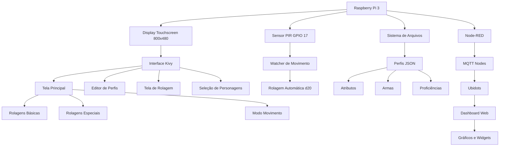

# D&D Dice Roller - Projeto Semestral

D&D Dice Roller é um sistema embarcado desenvolvido como projeto semestral da disciplina Microcontroladores e Sistemas Embarcados (EEN251) do Instituto Mauá de Tecnologia. Trata-se de um rolador de dados digital interativo para RPG de mesa (Dungeons & Dragons), capaz de realizar diversos tipos de rolagens com cálculo automático de modificadores, combinando interface touchscreen com sensor de movimento PIR para detecção de gestos.

## Sumário
- [Requisitos](#requisitos)
- [Escopo](#escopo)
- [Diagrama de blocos](#diagrama-de-blocos)
- [Tecnologias](#tecnologias)
- [Materiais](#materiais)
- [Modelagem financeira](#modelagem-financeira)
- [Funcionamento](#funcionamento)
- [Dashboard e Monitoramento](#dashboard-e-monitoramento)
- [Instalação](#instalação)
- [Autores](#autores)

## Requisitos
| ID | Requisito | Tipo |
|----|-----------|------|
| 1  | Utilizar sensor PIR para detecção de movimento | Técnico |
| 2  | Interface touchscreen para interação com usuário | Funcional |
| 3  | Sistema de gerenciamento de personagens D&D | Funcional |
| 4  | Cálculo automático de modificadores e proficiências | Funcional |
| 5  | Utilizar Raspberry Pi 3 como plataforma embarcada | Técnico |
| 6  | Animações visuais para simulação de rolagem de dados | Funcional |
| 7  | Suporte a múltiplos tipos de dados (d4, d6, d8, d10, d12, d20, d100) | Funcional |
| 8  | Sistema de rolagem por movimento (gesture-based rolling) | Técnico |
| 9  | Armazenamento persistente de perfis de personagens | Funcional |
| 10 | Interface gráfica adaptada para tela 800x480 | Técnico |
| 11 | Dashboard web para monitoramento remoto de rolagens | Funcional |
| 12 | Comunicação MQTT para transmissão de dados em tempo real | Técnico |

## Escopo
O projeto consiste em um rolador de dados digital para D&D 5ª Edição que oferece:

1. **Sistema de Personagens**: Gerenciamento completo de fichas com atributos, níveis e proficiências
2. **Rolagens Especializadas**:
   - Ataques com armas (com modificadores de habilidade e proficiência)
   - Testes de resistência (saving throws)
   - Testes de habilidade e perícias (18 skills do D&D 5e)
   - Rolagens de dano
3. **Rolagem por Movimento**: Sensor PIR detecta movimento do jogador para disparar rolagens de d20
4. **Interface Touchscreen**: Sistema completo de teclado virtual e navegação por toque
5. **Animações Visuais**: Dados 3D rotacionando durante as rolagens
6. **Dashboard Web Interativo**: Monitoramento remoto via Node-RED e Ubidots com comunicação MQTT

## Diagrama de blocos


## Tecnologias
- **Python 3.11**: Linguagem principal do projeto
- **Kivy 2.1.0**: Framework para interface gráfica touchscreen
- **RPi.GPIO**: Controle de GPIO para sensor PIR
- **Threading**: Monitoramento assíncrono do sensor de movimento
- **JSON**: Armazenamento persistente de dados de personagens
- **Canvas Graphics**: Animações 2D de dados rotacionando
- **Event-Driven Architecture**: Sistema de callbacks para interações
- **Object-Oriented Design**: Estrutura modular com componentes reutilizáveis
- **MQTT (Paho MQTT)**: Protocolo de comunicação IoT para transmissão de dados
- **Node-RED**: Plataforma de automação para processamento de fluxo de dados
- **Ubidots**: Plataforma IoT para visualização de dados em tempo real
- **File System Monitoring**: Leitura e processamento de logs de rolagem

## Materiais
| Componente | Quantidade |
|------------|------------|
| Raspberry Pi 3 Model B+ | 1 |
| Display Touchscreen 7" 800x480 | 1 |
| Sensor PIR HC-SR501 | 1 |
| Cartão MicroSD 16GB | 1 |
| Fonte 5V 2.5A Micro USB | 1 |
| Cabos Jumper Fêmea-Fêmea | 3 |
| Case para Raspberry Pi | 1 |

**Diagrama de conexões:**

```
Raspberry Pi 3 (GPIO BCM):
  GPIO 17 -> OUT (PIR Sensor)
  5V      -> VCC (PIR Sensor)
  GND     -> GND (PIR Sensor)
  
Display Touchscreen:
  DSI     -> Conector DSI (Raspberry Pi)
  USB     -> Porta USB (Touch Input)
```

**Pinout do Sensor PIR:**
- VCC: 5V (alimentação)
- GND: Terra
- OUT: GPIO 17 (sinal digital de detecção)

## Modelagem financeira

| Item | Preço Unitário (R$) | Quantidade | Preço Total (R$) |
|------|---------------------|------------|------------------|
| Raspberry Pi 3 Model B+ | 350,00 | 1 | 350,00 |
| Display Touchscreen 7" 800x480 | 250,00 | 1 | 250,00 |
| Sensor PIR HC-SR501 | 8,00 | 1 | 8,00 |
| Cartão MicroSD 16GB Classe 10 | 25,00 | 1 | 25,00 |
| Fonte 5V 2.5A Micro USB | 30,00 | 1 | 30,00 |
| Cabos Jumper | 15,00 | 1 conjunto | 15,00 |
| Case Raspberry Pi com suporte display | 45,00 | 1 | 45,00 |
| **TOTAL** | | | **723,00** |

## Funcionamento

### 1. Inicialização
```python
# Configuração do display e GPIO
Config.set('graphics', 'fullscreen', '1')
Config.set('graphics', 'width', '0')
Config.set('graphics', 'height', '0')

# Inicialização do sensor PIR
GPIO.setmode(GPIO.BCM)
GPIO.setup(17, GPIO.IN)
```

### 2. Sistema de Personagens
- **Criação de Perfis**: Formulário completo com:
  - Nome do personagem
  - Nível (1-20)
  - 6 atributos (STR, DEX, CON, INT, WIS, CHA)
  - Lista de armas personalizadas
  - Proficiências em perícias (18 skills)
  - Proficiências em testes de resistência

- **Armazenamento**: Arquivos JSON em `data/characters`
  ```json
  {
    "name": "Gandalf",
    "level": 20,
    "abilities": {"STR": 10, "DEX": 12, "CON": 14, "INT": 18, "WIS": 16, "CHA": 14},
    "weapons": [
      {"name": "Cajado", "ability": "STR", "proficient": true, "damage_dice": "d6", "damage_bonus": 0}
    ],
    "skill_proficiencies": ["Arcana", "History", "Investigation"],
    "saving_throw_proficiencies": ["INT", "WIS"]
  }
  ```

### 3. Tipos de Rolagem

#### A. Rolagens Básicas
- **Dados suportados**: d4, d6, d8, d10, d12, d20, d100, Custom
- **Animação**: Rotação 720° + escala pulsante (1.3x → 0.8x → 1.0x)
- **Imagens**: PNG dos dados reais em `assets/images`

#### B. Rolagens de Ataque
```python
# Cálculo automático
modifier = ability_modifier + proficiency_bonus
total = 1d20 + modifier

# Exemplo: Ataque com espada (+3 STR, proficiente, nível 5)
# modifier = 3 + 3 = +6
# Rolagem: 1d20+6
```

#### C. Testes de Habilidade
- **18 Skills do D&D 5e**:
  - STR: Athletics
  - DEX: Acrobatics, Sleight of Hand, Stealth
  - INT: Arcana, History, Investigation, Nature, Religion
  - WIS: Animal Handling, Insight, Medicine, Perception, Survival
  - CHA: Deception, Intimidation, Performance, Persuasion

- **Cálculo com proficiência**:
  ```python
  if skill in character.skill_proficiencies:
      modifier = ability_modifier + proficiency_bonus
  else:
      modifier = ability_modifier
  ```

#### D. Rolagem por Movimento (Motion Sensor)
1. **Ativação**: Usuário pressiona "Motion Sensor Roll (d20)"
2. **Estabilização**: Sensor aguarda 6 segundos para calibração
3. **Detecção**: Thread monitora GPIO.input(17) a cada 0.1s
4. **Trigger**: Ao detectar movimento, dispara rolagem automática de d20
5. **Log**: Imprime no console: `Roll: {character_name} rolled {value}`

### 4. Fluxo de Interface

```
[Tela Principal]
  ├─> Selecionar Personagem → [Lista de Perfis]
  ├─> Attack → [Seleção de Arma] → [Rolagem d20+mod] → [Resultado Hit/Miss]
  ├─> Saving Throw → [Escolha STR/DEX/CON/INT/WIS/CHA] → [Rolagem d20+mod]
  ├─> Ability Check → [18 Skills] → [Rolagem d20+mod+prof]
  ├─> Dados (d4-d100) → [Animação] → [Resultado]
  └─> Motion Sensor Roll → [Aguarda movimento] → [Rolagem d20 automática]
```

### 5. Componentes Customizados

#### PrimaryButton
```python
class PrimaryButton(Button):
    background_color = [0.863, 0.078, 0.235, 1]  # Crimson
    color = [1, 1, 1, 1]  # Texto branco
    font_size = 18
    bold = True
```

#### DiceButton
```python
class DiceButton(Button):
    background_color = [0.863, 0.078, 0.235, 1]  # Vermelho
    # Animação de pressão/soltura
```

#### Virtual Keyboard
- Teclado QWERTY completo em tela
- Números e caracteres especiais
- Backspace, Space, Enter
- Auto-foco em campos de texto

### 6. Sistema de Animação

```python
class DiceAnimation:
    def start_roll(self, dice_type, duration=2.0, pause_before=0.5):
        # 1. Pausa inicial (0.5s)
        # 2. Carrega imagem do dado (assets/images/d{type}.png)
        # 3. Rotação de 720° em 2 segundos
        # 4. Escala: 1.0 → 1.3 → 0.8 → 1.0
        # 5. Randomização de valores durante rolagem
        # 6. Exibição do resultado final
```

## Dashboard e Monitoramento

O projeto integra um sistema completo de monitoramento remoto utilizando **Node-RED** e **Ubidots** para visualização em tempo real das rolagens de dados realizadas no Raspberry Pi.

### Arquitetura do Dashboard

```
[Raspberry Pi] → [stdout log] → [File System] → [Node-RED File Reader]
                                                        ↓
                                                   [Parser JSON]
                                                        ↓
                                            [MQTT Publisher (Node-RED)]
                                                        ↓
                                                [Broker MQTT Ubidots]
                                                        ↓
                                            [Dashboard Web Ubidots]
```

### 1. Captura de Dados

Toda rolagem de d20 gera um log no formato:
```
Roll: Gandalf rolled 15
```

Este log é:
1. **Impresso no stdout** pela aplicação Python
2. **Redirecionado para arquivo** via script de execução
3. **Monitorado pelo Node-RED** através do nó "file in"

### 2. Processamento no Node-RED

O fluxo Node-RED realiza:

#### A. Leitura de Arquivo
```javascript
// Nó: file in
// Path: /home/pi/dice_rolls.log
// Output: cada nova linha do arquivo
```

#### B. Parsing de Dados
```javascript
// Nó: function (Parse Roll Data)
var msg_text = msg.payload;
var match = msg_text.match(/Roll: (.+) rolled (\d+)/);

if (match) {
    msg.payload = {
        character: match[1],
        roll_value: parseInt(match[2]),
        timestamp: new Date().getTime()
    };
    return msg;
}
return null;
```

#### C. Publicação MQTT
```javascript
// Nó: mqtt out
// Server: industrial.api.ubidots.com:1883
// Topic: /v1.6/devices/dnd-dice-roller
// Credentials: Token de API Ubidots

{
    "character": "Gandalf",
    "roll_value": 15,
    "timestamp": 1698364800000
}
```

### 3. Visualização no Ubidots

O dashboard Ubidots apresenta:

#### Widgets Implementados

| Widget | Tipo | Descrição |
|--------|------|-----------|
| **Último Personagem** | Indicator | Nome do último personagem que rolou |
| **Valor da Rolagem** | Gauge | Valor do último d20 (1-20) |
| **Histórico de Rolagens** | Line Chart | Gráfico temporal dos últimos 50 rolls |
| **Distribuição** | Bar Chart | Frequência de cada valor (1-20) |
| **Contador de Críticos** | Metric | Total de 20s naturais |
| **Contador de Falhas** | Metric | Total de 1s naturais |
| **Taxa de Sucesso** | Thermometer | % de rolagens ≥ 10 |

#### Configuração de Variáveis Ubidots

```json
{
  "variables": {
    "character": {
      "name": "Character Name",
      "type": "string"
    },
    "roll_value": {
      "name": "D20 Roll",
      "type": "integer",
      "min": 1,
      "max": 20
    },
    "timestamp": {
      "name": "Roll Time",
      "type": "timestamp"
    }
  }
}
```

### 4. Fluxo Node-RED Completo

```
[File Reader] → [Split Lines] → [Parse Regex] → [JSON Builder] → [MQTT Out]
     ↓                                                                  ↓
[Watch File]                                                    [Ubidots API]
     ↓                                                                  ↓
[Tail Mode]                                                      [Dashboard]
```

**Nodes utilizados:**
- `node-red-node-tail`: Monitoramento contínuo de arquivo
- `function`: Parsing de texto para JSON
- `mqtt`: Publicação em broker Ubidots
- `debug`: Logging de erros

### 5. Configuração do Sistema

#### A. Redirecionamento de Log (Raspberry Pi)
```bash
# run_dice_roller.sh
#!/bin/bash
cd /home/pi/Documentos/t2_micro
source .venv/bin/activate
python3 app.py 2>&1 | tee -a /home/pi/dice_rolls.log
```

#### B. Instalação Node-RED
```bash
# No Raspberry Pi
bash <(curl -sL https://raw.githubusercontent.com/node-red/linux-installers/master/deb/update-nodejs-and-nodered)
sudo systemctl enable nodered.service
sudo systemctl start nodered

# Instalar nodes adicionais
cd ~/.node-red
npm install node-red-node-tail
npm install node-red-contrib-mqtt-broker
```

#### C. Configuração Ubidots
1. Criar conta em [ubidots.com](https://ubidots.com)
2. Criar device "dnd-dice-roller"
3. Configurar variáveis: `character`, `roll_value`
4. Obter **API Token** em: Account → API Credentials
5. Configurar MQTT:
   - Broker: `industrial.api.ubidots.com`
   - Port: `1883`
   - Username: `<UBIDOTS_TOKEN>`
   - Password: (deixar em branco)

### 6. Exemplo de Fluxo Node-RED (JSON)

```json
[
    {
        "id": "file_reader",
        "type": "tail",
        "filename": "/home/pi/dice_rolls.log",
        "split": true,
        "name": "Watch Dice Rolls"
    },
    {
        "id": "parser",
        "type": "function",
        "func": "var match = msg.payload.match(/Roll: (.+) rolled (\\d+)/);\nif (match) {\n    msg.payload = {\n        character: match[1],\n        roll_value: parseInt(match[2])\n    };\n    return msg;\n}\nreturn null;",
        "name": "Parse Roll"
    },
    {
        "id": "mqtt_pub",
        "type": "mqtt out",
        "broker": "ubidots_broker",
        "topic": "/v1.6/devices/dnd-dice-roller",
        "name": "Publish to Ubidots"
    }
]
```

### 7. Monitoramento em Tempo Real

O sistema permite:

✅ **Visualização remota** de todas as rolagens  
✅ **Análise estatística** da distribuição de valores  
✅ **Detecção de padrões** (ex: excesso de críticos suspeitos)  
✅ **Histórico completo** armazenado na nuvem  
✅ **Alertas personalizados** via Ubidots Events  
✅ **Acesso multiplataforma** (Web, iOS, Android)

### 8. Troubleshooting Dashboard

**Problema**: Dados não aparecem no Ubidots  
**Solução**: 
1. Verificar logs Node-RED em `http://raspberry-pi:1880`
2. Confirmar token Ubidots válido
3. Testar conexão MQTT: `mosquitto_pub -h industrial.api.ubidots.com -t test -m "hello"`

**Problema**: Node-RED não lê arquivo  
**Solução**:
1. Verificar permissões: `chmod 644 /home/pi/dice_rolls.log`
2. Confirmar path absoluto no nó `tail`
3. Reiniciar Node-RED: `sudo systemctl restart nodered`

## Instalação

### Requisitos
- Raspberry Pi OS (Bookworm ou superior)
- Python 3.11+
- Tela touchscreen 800x480

### Dependências
```bash
sudo apt update
sudo apt install python3-pip python3-kivy python3-rpi.gpio
pip3 install kivy==2.1.0
```

### Execução
```bash
cd /home/pi/Documentos/t2_micro
python3 app.py
```

## Estrutura de Arquivos
```
t2_micro/
├── app.py                      # Aplicação principal
├── main.py                     # Ponto de entrada alternativo
├── components/                 # Componentes reutilizáveis
│   ├── buttons.py             # PrimaryButton, DiceButton
│   ├── dialogs.py             # Diálogos de seleção
│   ├── text_inputs.py         # Campos de texto customizados
│   ├── virtual_keyboard.py    # Teclado virtual
│   └── dice_animations.py     # Animações de dados
├── screens/                    # Telas da aplicação
│   ├── main_screen.py         # Tela principal
│   ├── roll_screen.py         # Tela de rolagem
│   ├── profile_screen.py      # Lista de personagens
│   └── profile_editor.py      # Editor de personagem
├── kv/                         # Arquivos de layout Kivy
│   ├── main_screen.kv
│   ├── roll_screen.kv
│   ├── profile_screen.kv
│   └── profile_editor.kv
├── utils/                      # Utilitários
│   ├── file_utils.py          # Gerenciamento de arquivos JSON
│   └── motion_sensor.py       # Interface com sensor PIR
├── assets/
│   └── images/                # Imagens dos dados (PNG)
│       ├── d4.png
│       ├── d6.png
│       ├── d8.png
│       ├── d10.png
│       ├── d12.png
│       ├── d20.png
│       └── d100.png
├── data/
│   └── characters/            # Perfis salvos (JSON)
├── run_dice_roller.sh         # Script de execução
└── DnD_Dice_Roller.desktop    # Atalho para desktop
```


**Status**: ✅ Aprovado

## Autores
- Amanda Carolina Ambrizzi Ramin (22.00721-0)
- André Felipe Silva Xavier (22.01339-3)
- Otto Camargo Kuchkarian (22.00571-4)
- Rafael Assanti (22.01464-0)
- Rodrigo Fernandes Faltz (21.01660-7)

---

**Instituto Mauá de Tecnologia**  
*Microcontroladores e Sistemas Embarcados - EEN251*  
Outubro de 2025
